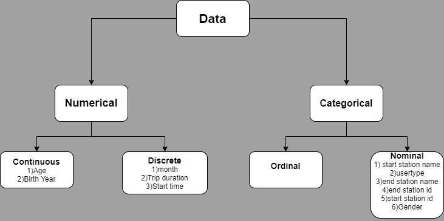

```{r setup, include=FALSE}
knitr::opts_chunk$set(echo = TRUE)
```

\tableofcontents
\pagebreak


# Introduction

For our dataset, we worked on a bike sharing system born in July 2011 in Metro Boston, known as BlueBikes.The system is simple a user can pick up a bike at any station dock, ride it for a specific amount of time, and then return it to any station for re-docking.

This investigation will review the different factors that affect the trip duration of users using this bike service in order to figure out which variable the company should focus on to increase overall trip duration of its users.

# Methods/Tools

For our analysis we used the following libraries:

```{r eval=TRUE, echo=TRUE}
# Attaching the required libraries
library(readr)
library(tidyverse)
library(dplyr)
library(ggplot2)
library(ggpubr)
library(cowplot) # required to arrange multiple plots in a grid
theme_set(theme_bw(base_size=12)) # set default ggplot2 theme
library(magrittr)
library(grid) # required to draw arrows
library(FactoMineR)
library(factoextra)
library(devtools)
library(lazyeval)
library(plotly)
library(farver)
library(corrplot)
```

Firstly to get an overview of the dataset, we import the dataset and viewed the first few rows.

```{r eval=TRUE, echo=TRUE}
df <- read_csv(
  "../data/modified_bluebikes_tripdata_2019.csv", 
    col_types = cols(`Unnamed: 0` = col_skip())
    )

head(df)
```

Now we check the dimension of the dataset and the data types of each column

```{r eval=TRUE, echo=TRUE}
dim(df)
str(df)
```

The dataset has **2522771 rows** and **11 columns**.

* tripduration: duration of trip in seconds.
* starttime: start time and date of trip.
* start station id: unique ID of station the trip started at.
* start station name: name of station the trip started at.
* end station id: unique ID of station the trip started at.
* end station name: name of station the trip ended at.
* usertype: type of user can be Customer or Subscriber.
* birth year: birth year of user.
* gender: gender of user.
* month: month of when the trip took place.
* age: age of the user in 2019.

## Mapping of categorical and numerical data.


## Data Cleaning

First we check for missing values.

```{r eval=TRUE, echo=TRUE}
sum(is.na(df))
```

There are no missing values in the set the data type of the column **gender** is double so we have to change its data type to character. We also rearrange the data according to the **gender** and **usertype** columns

```{r eval=TRUE, echo=TRUE}
# Changing the data type for the gender column
df$gender <- as.character(df$gender)

# Rearranging the data
df <- df %>% arrange(gender) %>% arrange(desc(usertype))

head(df)
```

Now we check for any anomaly in the dataset.

```{r eval=TRUE, echo=TRUE}
# Histogram for 'birth year column
ggplot(df, aes(x = `birth year`)) +
  geom_histogram(
    breaks = seq(1880, 2010, by = 1),
    fill = "#e9ecef",
    color = "#69b3a2",
    alpha = 0.9
  ) +
  labs(
    title = "Birth Year of Users",
    caption = "Histogram for Birth Year of Users",
    x = "Birth Year"
  ) + ylim(0, 277000)
```

We can see an anomalous peak at the year 1969. So, we can resample the data for the year 1969, by randomly assigning the value a year between 1960 and 1980 inclusive.

```{r eval=FALSE, echo=TRUE}
# Removing the anomalous peak at the year 1969
for (i in c(1, 2522771)) {
  if (df$`birth year`[i] >= 1960 & df$birth.year[i] <= 1980) {
    df$resampled_by[i] <- sample(1960:1980, 1)
  } else {
    df$resampled_by[i] <- i
  }
}
```

We recalculate the age column and also add a age_group column

```{r eval=TRUE, echo=TRUE}
# Recalculate the age column from the resampled_by (resampled birth year) column
df$age <- 2019 - df$resampled_b_y

# Add a age_group coulmn
labs <- c(paste(seq(16, 65, by = 5), seq(16 + 5 - 1, 65, by = 5), sep = "-"))
df$age_group <- cut(df$age,
  breaks = c(seq(16, 65, by = 5), Inf),
  labels = labs, right = FALSE
)
```


We now plot the **resampled_b_y** column to see the resampled data

```{r eval=TRUE, echo=TRUE}
# Histogram for Resampled Birth Year of Users
ggplot(df, aes(x = `resampled_b_y`)) +
  geom_histogram(
    breaks = seq(1880, 2010, by = 1),
    fill = "#e9ecef",
    color = "#69b3a2",
    alpha = 0.9
  ) +
  labs(
    title = "Resampled Birth Year of Users",
    caption = "Histogram for Resampled Birth Year of Users",
    x = "Birth Year"
  ) + ylim(0, 277000)
```


Now we check for outliers in the **age** and **tripduration** columns.

```{r eval=TRUE, echo=TRUE}
# Boxplots to check if there are outliers
ggplot(df, aes(y = age)) +
  geom_boxplot(
    fill = "#e9ecef",
    color = "#69b3a2"
  ) +
  labs(title = "Resampled Age of Users", caption = "Box-plot for Resampled Age of Users (Before Removing Outliers)", y = "Age") + theme(
  plot.caption = element_text(hjust = 0.5)
  ) + ylim(0, 135)

ggplot(df, aes(y = tripduration)) +
  geom_boxplot(
    fill = "#e9ecef",
    color = "#69b3a2"
  ) +
  labs(title = "Trip Duration of Users", caption = "Box-plot for Trip Duration of Users (Before Removing Outliers)", y = "Trip Duration") + theme(
  plot.caption = element_text(hjust = 0.5)
  ) + ylim(0, 709455)
```


Since there are a lot of outliers for both the columns we can remove them and replot the boxplots.

```{r eval=TRUE, echo=TRUE}
# Removing outliers from resampled_b_y(resampled birth year) and tripduration
outliers <- boxplot(df$age, plot = FALSE)$out
df <- df[-which(df$age %in% outliers), ]

outliers <- boxplot(df$tripduration, plot = FALSE)$out
df <- df[-which(df$tripduration %in% outliers), ]
```

```{r eval=TRUE, echo=TRUE}
# Replotting after removing outliers

ggplot(df, aes(y = age)) +
  geom_boxplot(
    fill = "#e9ecef",
    color = "#69b3a2"
  ) +
  labs(
    title = "Resampled Age of Users",
    caption = "Box-plot for Resampled Age of Users (After Removing Outliers)",
    y = "Age"
  ) + theme(
  plot.caption = element_text(hjust = 0.5)
  ) + ylim(0, 135)

ggplot(df, aes(y = tripduration)) +
  geom_boxplot(
    fill = "#e9ecef",
    color = "#69b3a2"
  ) +
  labs(
    title = "Trip Duration of Users",
    caption = "Box-plot for Trip Duration of Users (After Removing Outliers)",
    y = "Trip Duration"
  ) + theme(
  plot.caption = element_text(hjust = 0.5)
  ) + ylim(0, 709455)

```

Now we can see that there are far less outliers than before.

## Descriptive Statistics

```{r}
# Calculate mean, median, variance and standard deviation of variables
td_mean <- mean(df$tripduration)
td_med <- median(df$tripduration)
td_var <- var(df$tripduration)
td_sd <- sd(df$tripduration)

by_mean <- mean(df$resampled_b_y)
by_med <- median(df$resampled_b_y)
by_var <- var(df$resampled_b_y)
by_sd <- sd(df$resampled_b_y)

age_mean <- mean(df$age)
age_med <- median(df$age)
age_var <- var(df$age)
age_sd <- sd(df$age)

# Create a summary statistics matrix with 4 columns and 3 rows
summary_stats <- matrix(c(
  td_mean, td_med, td_var, td_sd,
  by_mean, by_med, by_var, by_sd,
  age_mean, age_med, age_var, age_sd
),
ncol = 4,
byrow = TRUE
)

# Define column names and row names
colnames(summary_stats) <- c("Mean", "Median", "Varience", "SD")
rownames(summary_stats) <- c("Trip Duration", "Birth Year", "Age")

# Convert matrix to table and view the table
summary_stats <- as.table(summary_stats)
summary_stats
```

## Preliminary Analysis

```{r echo=TRUE, eval=TRUE}
ggplot(df, aes(x = tripduration)) +
  geom_histogram(
    fill = "#e9ecef",
    color = "#69b3a2",
    breaks = seq(0, 40, by = 1)
  ) +
  labs(
    title = "Trip Duration",
    caption = "Histogram for Trip Duration",
    x = "Trip Duration"
  ) + theme(
  plot.caption = element_text(hjust = 0.5)
  )

ggplot(df, aes(x = month)) +
  geom_histogram(
    fill = "#e9ecef",
    color = "#69b3a2",
    bins = 12
  ) +
  labs(
    title = "Month of the Trips",
    caption = "Histogram for Month of the Trips",
    x = "Month"
  ) + theme(
  plot.caption = element_text(hjust = 0.5)
  )

ggplot(df, aes(x = age)) +
  geom_histogram(
    fill = "#e9ecef",
    color = "#69b3a2",
    breaks = seq(16, 65, by = 2)
  ) +
  labs(
    title = "Age of Users",
    caption = "Histogram for Age of Users",
    x = "Age"
  ) + theme(
  plot.caption = element_text(hjust = 0.5)
  )
```


```{r}
# rescale
df$scaled_age <- scale(df$age)

hist(df$scaled_age,
  main = "Histogram for Standardized Age of Users",
  xlab = "Age", breaks = 20
)
```


## Statistical Tests

In this section we carry out some statistical test and interpret them.

### Wilcoxon Rank Sum Test (Mann-Whitney Test)

#### Trip Duration And Gender

```{r}
# Boxplot for tripduration by gender
ggplot(df %>% filter(gender != "0") %>% select(gender, tripduration)) +
  aes(x = gender, y = tripduration) +
  geom_boxplot(fill = "lightblue") +
  theme_minimal() +
  labs(
    title = "Box-plot for Trip Duration For Males and Females",
    x = "Gender", y = "Trip Duration"
  ) +
  scale_x_discrete(labels = c("1" = "Males", "2" = "Females"))
```


```{r}
qqnorm(subset(df, gender == 1)$tripduration,
  main = "Q-Q Plot for Trip Duration for Males"
)
qqline(subset(df, gender == 1)$tripduration, col = 3, lwd = 2)

qqnorm(subset(df, gender == 2)$tripduration,
  main = "Q-Q Plot for Trip Duration for Females"
)
qqline(subset(df, gender == 2)$tripduration, col = 3, lwd = 2)
```

The Q-Q plots show that both the distributions do not follow a normal distribution.

So, we perform the Wilcoxon Test with the following null and alternative hypothesis:

* H0 : the 2 groups are similar
* H1 : the 2 groups are different


```{r}
df_temp <- df %>% filter(gender != "0") %>% select(gender, tripduration)
wilcox.test(df_temp$tripduration ~ df_temp$gender)
```

Here the p-value is 2.2x10^(-16). Thus, at the 5% significance level, we reject the null hypothesis and conclude that the tripdurations are significantly different.

In the above boxplot we see that the tripduration for females is higher than that for males. To check this we can use the following null and alternative hypothesis:

* H0 : male tripduration > female tripduration
* H1 : male tripduration < female tripduration

```{r}
wilcox.test(df_temp$tripduration ~ df_temp$gender, alternative = "less")
```

Here the p-value is 2.2x10^(-16). Thus, at the 5% significance level, we reject the null hypothesis and conclude that males have a significantly lower tripduration than females.


#### Trip Duration And User Type

```{r}
# Distribution of tripduration by usertype
ggplot(df) +
  aes(x = usertype, y = tripduration) +
  geom_boxplot(fill = "lightblue") +
  theme_minimal() +
  labs(
    title = "Box-plot for Trip Duration For Each User Type", x = "User Type",
    y = "Trip Duration"
  )
```


```{r}
qqnorm(subset(df, usertype == "Customer")$tripduration,
  main = "Q-Q Plot for Trip Duration for Customer"
)
qqline(subset(df, usertype == "Customer")$tripduration, col = 3, lwd = 2)

qqnorm(subset(df, usertype == "Subscriber")$tripduration,
  main = "Q-Q Plot for Trip Duration for Subscriber"
)
qqline(subset(df, usertype == "Subscriber")$tripduration, col = 3, lwd = 2)
```

The Q-Q plots show that both the distributions do not follow a normal distribution.

So, we perform the Wilcoxon Test with the following null and alternative hypotesis:

* H0 : the 2 groups are similar
* H1 : the 2 groups are different


```{r}
wilcox.test(df$tripduration ~ df$usertype)
```

Here the p-value is 2.2x10^(-16). Thus, at the 5% significance level, we reject the null hypothesis and conclude that the tripdurations are significantly different.

In the above boxplot we see that the tripduration for Customer is higher than that for males. To check this we can use the following null and alternative hypothesis:

* H0 : Customer tripduration < Subscriber tripduration
* H1 : Customer tripduration > Subscriber tripduration

```{r}
wilcox.test(df$tripduration ~ df$usertype, alternative = "greater")
```

Here the p-value is 2.2x10^(-16). Thus, at the 5% significance level, we reject the null hypothesis and conclude that Subscriber have a significantly lower tripduration than Customer.


#### Age and Gender

```{r}
# Distribution of age by gender
ggplot(df %>% filter(gender != "0") %>% select(gender, age)) +
  aes(x = gender, y = age) +
  geom_boxplot(fill = "lightblue") +
  theme_minimal() +
  labs(
    title = "Box-plot for Age For Males and Females",
    x = "Gender",
    y = "Age"
  ) +
  scale_x_discrete(labels = c("1" = "Males", "2" = "Females"))
```


```{r}
qqnorm(subset(df, gender == "1")$age, main = "Q-Q Plot for Age for Males")
qqline(subset(df, gender == "1")$age, col = 3, lwd = 2)

qqnorm(subset(df, gender == "2")$age, main = "Q-Q Plot for Age for Females")
qqline(subset(df, gender == "2")$age, col = 3, lwd = 2)
```

The Q-Q plots show that both the distributions do not follow a normal distribution.

So, we perform the Wilcoxon Test with the following null and alternative hypothesis:

H0 : the 2 groups are similar
H1 : the 2 groups are different


```{r}
df_temp <- df %>% filter(gender != "0") %>% select(gender, age)
wilcox.test(df_temp$age ~ df_temp$gender)
```

Here the p-value is 2.2x10^(-16). Thus, at the 5% significance level, we reject the null hypothesis and conclude that the ages are significantly different.

In the above boxplot we see that the age for females is higher than that for males. To check this we can use the following null and alternative hypothesis:

* H0 : male age < female age
* H1 : male age > female age

```{r}
wilcox.test(df_temp$age ~ df_temp$gender, alternative = "greater")
```

Here the p-value is 2.2x10^(-16). Thus, at the 5% significance level, we reject the null hypothesis and conclude that males have a significantly higher age than females.


#### Age and User Type

```{r}
# Distribution of age by usertype
ggplot(df) +
  aes(x = usertype, y = age) +
  geom_boxplot(fill = "lightblue") +
  theme_minimal() +
  labs(
    title = "Box-plot for Age For Each User Type",
    x = "User Type",
    y = "Age"
  )
```


```{r}
qqnorm(subset(df, usertype == "Customer")$age,
  main = "Q-Q Plot for Age for Customer"
)
qqline(subset(df, usertype == "Customer")$age,
  col = 3,
  lwd = 2
)

qqnorm(subset(df, usertype == "Subscriber")$age,
  main = "Q-Q Plot for Age for Subscriber"
)
qqline(subset(df, usertype == "Subscriber")$age, col = 3, lwd = 2)
```

The Q-Q plots show that both the distributions do not follow a normal distribution.

So, we perform the Wilcoxon Test with the following null and alternative hypothesis:

* H0 : the 2 groups are similar
* H1 : the 2 groups are different

```{r}
wilcox.test(df$age ~ df$usertype)
```

Here the p-value is 2.2x10^(-16). Thus, at the 5% significance level, we reject the null hypothesis and conclude that the ages are significantly different.

In the above box-plot we see that the age for Subscribers is higher than that for males. To check this we can use the following null and alternative hypothesis:

* H0 : Customer age < Subscriber age
* H1 : Customer age > Subscriber age

```{r}
wilcox.test(df$tripduration ~ df$usertype, alternative = "greater")
```

Here the p-value is 2.2x10^(-16). Thus, at the 5% significance level, we reject the null hypothesis and conclude that Subscribers have a significantly lower trip duration than Customer.

### Kruskal-Wallis Test

We know from the previous parts that the data is not normally distributed. So we cannot use ANOVA thus we use Kruskal-Wallis test.

#### Tripduration and Gender

```{r}
ggplot(df, aes(x=gender, y=tripduration, fill=gender)) +
    geom_boxplot(alpha=0.5) +
    stat_summary(fun="mean", geom="point", shape=20, size=7) +
    theme(legend.position="none")
```


```{r}
kruskal.test(tripduration ~ gender, data = df)
```

We get a p-value less than the significance level 0.05, so we conclude that there is a significant difference between the different genders.

To know between which genders are significantly different we apply pairwise Wilcoxon Test.

```{r}
pairwise.wilcox.test(df$tripduration, df$gender,
                 p.adjust.method = "BH")
```

The pairwise comparison shows that all groups are significantly different from each other as the p-values are less than 0.05.

#### Tripduration and Age Groups

```{r}
ggplot(df, aes(x=age_group, y=tripduration, fill=age_group)) +
    geom_boxplot(alpha=0.5) +
    stat_summary(fun="mean", geom="point", shape=20, size=7) +
    theme(legend.position="none")
```


```{r}
kruskal.test(tripduration ~ age_group, data = df)
```

We get a p-value less than the significance level 0.05, so we conclude that there is a significant difference between the different age groups.

To know between which genders are significantly different we apply Pairwise Wilcoxon Test.

```{r}
pairwise.wilcox.test(df$tripduration, df$age_group,
                 p.adjust.method = "BH")
```

The pairwise comparison shows that all the age groups are significantly different from each other as the p-values are less than 0.05.

## Linear Regression

```{r}
ggplot(df %>%filter(age_group == "16-20" | age_group == "21-25") %>% select(age, tripduration), aes(age, tripduration)) +
  geom_point() +
  stat_smooth(method = lm)+ ggtitle("Age group of 16-25 vs Trip duration(mins)") +
  xlab("Age") + ylab("Trip Duration (mins)")

ggplot(df %>%filter(age_group == "26-30" | age_group == "31-35") %>% select(age, tripduration), aes(age, tripduration)) +
  geom_point() +
  stat_smooth(method = lm)+ ggtitle("Age group of 26-35 vs Trip duration(mins)") +
  xlab("Age") + ylab("Trip Duration (mins)")

ggplot(df %>%filter(age_group == "36-40" | age_group == "41-45") %>% select(age, tripduration), aes(age, tripduration)) +
  geom_point() +
  stat_smooth(method = lm)+ ggtitle("Age group of 36-45 vs Trip duration(mins)") +
  xlab("Age") + ylab("Trip Duration (mins)")

ggplot(df %>%filter(age_group == "46-50" | age_group == "51-55") %>% select(age, tripduration), aes(age, tripduration)) +
  geom_point() +
  stat_smooth(method = lm)+ ggtitle("Age group of 46-55 vs Trip duration(mins)") +
  xlab("Age") + ylab("Trip Duration (mins)")

ggplot(df %>%filter(age_group == "56-60" | age_group == "61-65") %>% select(age, tripduration), aes(age, tripduration)) +
  geom_point() +
  stat_smooth(method = lm)+ ggtitle("Age group of 56-65 vs Trip duration(mins)") +
  xlab("Age") + ylab("Trip Duration (mins)")
```


We took a sample of 8k observations at random from the dataset.

```{r}
df_sample= sample_n(df, 8000) 
ggplot(df_sample, aes(age, tripduration)) +
  geom_point() +
  stat_smooth(method = lm)+ ggtitle("Random sample of 8k users Age vs Trip duration(mins)") +
  xlab("Age") + ylab("Trip Duration (mins)")
```


```{r}
lm(df$age ~ df$tripduration)
```
We see that the intercept is 31.6048 minutes and the slope is 0.1423.

## PCA

```{r eval=TRUE, echo=TRUE}
df_numerical <- df %>% select(tripduration, 'start station id', 'end station id', month, age)
head(df_numerical)
```

```{r eval=TRUE, echo=TRUE}
corrplot(cor(df_numerical), method="ellipse")
corrplot(cor(df_numerical), method="color")
```

```{r eval=TRUE, echo=TRUE}
df_pca <- prcomp(df_numerical, center = T, scale = T)
# Display the results from the PCA analysis
df_pca$rotation <- -1*df_pca$rotation

df_pca$rotation
```

We can see that the first principal component (PC1) has the highest value for Month which indicates that this principal component describes the most variation in the month of the trip.

We can also see that the second principal component (PC2) has the highest value for tripduration, which indicates that this principle component places most of its emphasis on the trip duration.

The principal components scores for each variable are stored in results$x. We will also multiply these scores by -1 to reverse the signs:

```{r}
#reverse the signs of the scores
df_pca$x <- -1*df_pca$x

#display the first six scores
head(df_pca$x)
```


```{r}
plot(df_pca, type="l", main = "Principal components weight")
grid(nx = 10, ny = 14)
title(sub = NULL, xlab = "Components")
box()
```


```{r}
percent <- 100*df_pca$sdev^2/sum(df_pca$sdev^2)
percent

perc_data <- data.frame(percent=percent, PC=1:length(percent))
ggplot(perc_data, aes(x=PC, y=percent)) + 
  geom_bar(stat="identity") + 
  geom_text(aes(label=round(percent, 2)), size=4, vjust=-.5) + 
  ylim(0, 100)
```
The percentage of variance explained by each Principal Component is the following:
* PC1 => 22.89%
* PC2 => 22.11%
* PC3 => 19.22%
* PC4 => 18.38%
* PC5 => 17.40%

```{r}
# capture the rotation matrix in a data frame
rotation_data <- data.frame(df_pca$rotation, 
                            variable=row.names(df_pca$rotation))
# define a pleasing arrow style
arrow_style <- arrow(length = unit(0.05, "inches"),
                     type = "closed")
# now plot, using geom_segment() for arrows and geom_text for labels
ggplot(rotation_data) + 
  geom_segment(aes(xend=PC1, yend=PC2), x=0, y=0, arrow=arrow_style) + 
  geom_text(aes(x=PC1, y=PC2, label=variable), hjust=0, size=3, color='red') + 
  xlim(-1.,1.25) + 
  ylim(-1.,1.) +
  coord_fixed() # fix aspect ratio to 1:1
```

From the graph we can say that the age of the user has a higher impact on the trip duration than the start and end points of the trip. And the month of the trip has the least impact.


# Results

* From the Wilcoxon Test we can conclude the following:
 + Males have a significantly lower trip duration than Females.
 + Subscriber have a significantly lower tripduration than Customer
 + Male have a significantly higher age than females.
 + Subscribers have a significantly lower trip duration than Customer

* From the Kruskal-Wallis Test and Pairwise Wilcoxon we can conclude the following:
* All the genders (male, female and unknown) have significantly different median trip duration.
* All the age groups (16-20, 21-25, 26-30, 31-35, 36-40, 41-45, 46-50, 51-55, 56-60, 61-65) have significantly different median trip duration.

* From the linear regression of Trip Duration by Age we found that the intercept is 31.6048 minutes and the slope is 0.1423.

* Finally the PCA concluded that the age of the user has a higher impact on the trip duration than the start and end points of the trip. And the month of the trip has the least impact.


# Summary/Discussion

Analysis of the BlueBikes data done in this project shows that the company should focus on advertising its services on the age and gender of the viewers (specifically females) in order to increase overall trip duration of its users.


# References

* Normality Test in R - Easy Guides - Wiki - STHDA. http://www.sthda.com/english/wiki/normality-test-in-

* Unpaired Two-Samples Wilcoxon Test in R - Easy Guides - Wiki - STHDA. http://www.sthda.com/english/wiki/unpaired-two-samples-wilcoxon-test-in-r

* Kruskal-Wallis Test in R - Easy Guides - Wiki - STHDA. http://www.sthda.com/english/wiki/kruskal-wallis-test-in-r

* PCA - Principal Component Analysis Essentials - Articles - STHDA. http://www.sthda.com/english/articles/31-principal-component-methods-in-r-practical-guide/112-pca-principal-component-analysis-essentials
